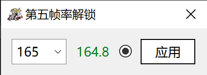

# 第五人格帧率解锁
解锁并设定第五人格(PC互通版)帧率上限

### 特性
1. 启动时自动应用历史fps值
2. 无需拨动滑块[^1]，甚至能在登入账号前设定
3. 不影响客户端发包频率[^2]
4. 长时间未操作自动关闭进程访问（最小侵入）

### 说明

在“第五人格”运行时启动该程序， 
于下拉框填写正整数fps值，或选择一个预设；回车↵或单击“应用”按钮设定帧率。 
点亮数值标签可查看实时帧率（不过应用帧率时也这里也会临时亮数秒以方便确认修改） 

勾选单选圆钮程序会在关闭时记忆fps、并在下次启动时自动应用（注意：会创建名为hipp的文件以保存）

不需要常驻后台，设定后可以直接关闭程序。

##### 注意：
1. 游戏中*局内外高帧率滑块状态需一致*，否则帧率会在进出对战时被重设
2. 不建议长时间读取实时帧率（与特性4的理念相悖）

  

---
### 声明
> *本项目为非官方的第三方程序，与原游戏开发商、发行商无任何关联，完全免费提供，仅供学习与个人娱乐使用：*
    ***禁止以任何形式用于商业盈利目的***
    ***使用本项目所产生的任何后果均由用户自行承担，作者不对任何直接或间接损失承担责任***

> *本项目使用Qt开发，遵循 [LGPLv3](https://www.gnu.org/licenses/lgpl-3.0.html)授权协议：*
    *本程序是自由软件：你可以再分发之和/或依照由自由软件基金会发布的 GNU 通用公共许可证修改之，无论是版本 3 许可证，还是（按你的决定）任何以后版都可以。*
    *发布本程序是希望它能有用，但是并无保障;甚至连可销售和符合某个特定的目的都不保证。请参看 GNU 通用公共许可证，了解详情。*
    *你应该随程序获得一份 GNU 通用公共许可证的复本。如果没有，请看 <https://www.gnu.org/licenses/>。*

> *如有侵权或其他问题请联系作者，本方将处理相关事宜，必要时作下架处理*

[^1]: [社区发现的一种解锁帧率的方式](https://www.bilibili.com/video/BV1ccGhzTEK7)
[^2]: [上述方式被注意到的的缺点](https://www.bilibili.com/video/BV1FVVRzgER7)
